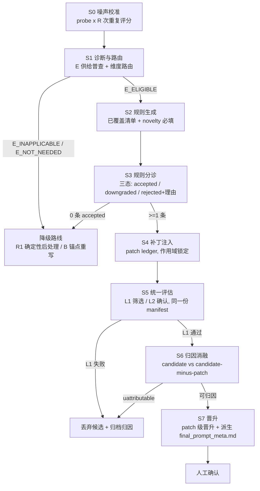

# E 类迭代机制 v2 设计（ETYPE-ITERATION-V2）

Date: 2026-09-19
Status: 设计稿（未实现）
依据：E 类四次真实失败记录 F1–F4、审查问题 1–7、真实产物
`etype_analysis/contrastive_consolidated_*.json`、`etype_analysis/micro_scoring_eval_etype_next.json`、
`etype_analysis/gate_eval_etype_next.json`、`final_prompt_meta.md`。

本设计**不修改** `E_VALIDATION_PLAN.md` 已冻结的基线，也不放松"人工显式晋升"约束。
它替换的是 E 路线**内部**的机制：规则从哪来、如何编译、如何注入、如何判定、如何归因。

---

## 1. 设计原则

| 编号 | 原则 | 直接对应的问题 |
|---|---|---|
| P1 | **单一事实来源**：一份样本清单、一份阈值、一份判据实现 | 问题 2、问题 3（两套门控判据不一致、样本仅 5/17 交集） |
| P2 | **判据相对噪声**：任何"改善/恶化"必须大于重复评分噪声底线 | C0（−1.0 是真实回归还是采样噪声，当前不可区分） |
| P3 | **失败必须可归因**：任何中止都要落盘结构化理由，禁止静默空转 | F1/F2（`stopped: no feasible E rule` 一行了事） |
| P4 | **规则是补丁，不是整份重写**：可单独移除、可单独归因 | 问题 7（单条规则同时承担因果假设与最终方案） |
| P5 | **供给与误差匹配**：某维无 E 供给时显式降级，不空转 | 问题 6（expression 零供给却误差最大） |
| P6 | **网格律**：阈值必须是样本可达最小非零变化的整数倍，且 `< grid` | §12（0.5 阈值与 0.5 分尾的实测冲突） |
| P7 | **分点契约律**：既有加粗分点的**名称与内容冻结**；新增分点仅限"操作分点"；E 侧注册表由 `final` **运行时动态解析** | §13；B2 命名漂移（`**语言分评价范围**` 在 V3 被改名） |
| P8 | **优化对象 = 部署对象**：从 `_meta.md` 删除不部署的章节，使两者等值 | §13.6；B6（优化器 3/4 的结构约束是关于部署时被剥离的章节） |

---

## 2. 目标流程总览



与现状的关键差别：

| 环节 | 现状 | v2 |
|---|---|---|
| 样本 | micro 17 篇、regular 12 篇，独立抽样，交集 5 篇 | 一份分层 manifest，L1/L2 共用 |
| 判据 | micro 硬编码在 `micro_scoring_gate.Config`，regular 在 `etype_iteration_runner.evaluate_gate` | 统一到 `gate_policy.py` |
| 单维恶化阈值 | micro `1.0` + 严格小于；regular `0.5` + 严格大于 | 统一 `0.5`，同一判定函数 |
| B-bias | micro 有（权重 2.0×严重度）；regular 无 | L1/L2 均有 |
| 规则过滤 | `compile_all_rules` 静默 `continue` | 三态落盘，理由可读 |
| 注入 | 整份 prompt 重写 | patch 账本，可单独移除 |
| 中止 | 一行 `stopped` | 结构化 route/triage 报告 |

---

## 3. 阶段详设

### S0 噪声底线校准

**动机**：`micro_scoring_eval_etype_next.json` 里 index 34 的 expression improvement = `-1.00`，
它究竟是规则造成的跨维泄漏，还是同一 prompt 重复评分的固有波动？现状无法回答，
于是后面所有"恶化"判据都建立在不可验证的差值上。这是**优先级高于其余一切的修复**。

**输入**
- `probe_indices`：固定探针集，每维取该维 abs error 最高的 3 篇 + 接近 0 的 3 篇，共 6 篇（可去重）
- `final_prompt_meta.md`（预处理后的 `final_prompt.md`）

**动作**：同一 prompt、同一探针集，重复评分 `R = 3` 次；每样本每维取**中位数**作为该次评分值。

**输出** `etype_analysis/noise_floor.json`

```json
{
  "created_at": "2026-09-19T21:00:00",
  "prompt_sha256": "...",
  "probe_manifest_sha256": "...",
  "repeats": 3,
  "aggregation": "median_of_3",
  "dimensions": {
    "content":    {"median_abs_range": 0.0, "p90_abs_range": 1.0, "probe_count": 6},
    "expression": {"median_abs_range": 0.0, "p90_abs_range": 1.0, "probe_count": 6},
    "structure":  {"median_abs_range": 1.0, "p90_abs_range": 2.0, "probe_count": 6}
  },
  "regression_epsilon": {"content": 1.0, "expression": 1.0, "structure": 2.0}
}
```

**消费规则**（写入 `gate_policy.py`）
- `required_improvement(dim) = max(min_target_improvement, noise_floor[dim])`
- `allowed_regression(dim)  = max(max_regression, noise_floor[dim])`
- 若 `noise_floor.json` 缺失 → `GatePolicy.mode = "uncalibrated"`，报告中显式标注，
  阈值回落为当前保守值，且**不允许 L2 通过后直接晋升**（必须人工确认 + 重新校准）。

**成本控制**：探针集缓存以 `(prompt_sha256, probe_manifest_sha256)` 为键；
只对 target_outlier 与 cross_probe 层做 3 次重复，normal / b_bias 层可单次。

---

### S1 诊断与路由

**动机**：F1/F2 的本质不是"没有规则"，而是"该维度本来就不该走 E 路线"。
`etype_preference_analyzer.py` 的 `analyze_dimension` 在 `len(outlier_samples) < 2` 时直接
`return None, None`；`RuleIntegrationEngine.select_target_dimension` 在无 feasible rule 时抛
`ValueError`；`ETypeIterationRunner.run` 只捕获它并记一行 `stopped`。
expression 维 severe=0/soft=0 → 数学上不可能产出 E 规则，却仍被调度。

**输出** `etype_analysis/etype_route_decision.json`

```json
{
  "created_at": "...",
  "baseline": {"scoring_file": "final_train_scoring_results.json",
               "prompt_sha256": "..."},
  "dimensions": {
    "content": {
      "outlier_supply": {"severe": 0, "soft": 9, "total": 9},
      "normal_supply": 24,
      "target_mae": 1.13,
      "evidence_floor_ok": true,
      "route": "E_ELIGIBLE",
      "reason": "supply>=2 and normal_supply>=1"
    },
    "expression": {
      "outlier_supply": {"severe": 0, "soft": 0, "total": 0},
      "normal_supply": 27,
      "target_mae": 1.42,
      "evidence_floor_ok": false,
      "route": "E_INAPPLICABLE",
      "reason": "no residual supply; target_mae 1.42 still high",
      "fallback": "postprocess_route | b_anchor_rewrite"
    },
    "structure": {
      "outlier_supply": {"severe": 2, "soft": 3, "total": 5},
      "normal_supply": 21,
      "target_mae": 1.21,
      "evidence_floor_ok": true,
      "route": "E_ELIGIBLE",
      "reason": "supply>=2 and normal_supply>=1"
    }
  },
  "priority_order": ["structure", "content"],
  "excluded": {"expression": "E_INAPPLICABLE"}
}
```

**路由表**

| 条件 | route | 后续 |
|---|---|---|
| `outlier_supply < 2` 或 `normal_supply < 1` | `E_INAPPLICABLE` | 转降级路线（R1 / B 锚点重写），**不进入 S2** |
| `evidence_floor_ok` 且 `target_mae >= mae_gate` | `E_ELIGIBLE` | 进入 S2 |
| `evidence_floor_ok` 且 `target_mae < mae_gate` | `E_NOT_NEEDED` | 冻结该维，写入 `etype_frozen_dims.json` |

**硬约束**：`etype_iteration_runner.run` 不再把"无可行规则"当成流水线终止。
它必须：写 `route_decision.json` → 若还有 `E_ELIGIBLE` 维则切换 → 否则走降级路线并记录
`pipeline.stopped_reason = "all_dimensions_inapplicable"`。

---

### S2 规则生成

对 `etype_preference_analyzer.build_contrastive_analysis_request` 的 system prompt 做四处修改。

**(a) 新增"已覆盖指令清单"区块**（修复问题 5）

由 `prompt_section_index.py` 从基底 prompt 抽出 `## 注意事项` 下每个加粗子标题的既有条目，逐条喂给模型：

```
# Already-Specified Instructions — DO NOT RESTATE
The base prompt ALREADY contains the following instructions. A rule that
restates one of them carries no new information and will be rejected as
`redundant_restatement`. Your rule must add a distinction NOT expressible
by any item below.

[**结构分特殊情形**]
- 缺少开头段、结尾段、无段落划分或段落混乱，结构分不超过3分
- 评结构分前先独立判断分段是否清晰、首尾是否齐全，不受错别字或语病影响
- ...
```

> 依据：审查已核实 4 轮 6 条 raw rule **无一贡献 prompt 中不存在的新判据**。
> 最典型的是 `consolidated_3` 规则 1「结构分应独立评价，不应因语言错误多而连带下调」，
> 与 `**结构分特殊情形**` 第二条同义。

**(b) `localized_prompt_rules` 增加必填字段**

```json
{
  "novelty": "new | refines | restates",
  "restates_target": "被重述的既有条目原文（novelty != new 时必填）",
  "expected_scope": ["structure"],
  "evidence_index_type": "global_index",
  "discriminating_condition": "在什么可观察条件下，本条与已覆盖条目的判定会不同"
}
```

`discriminating_condition` 是 (a) 的强制化：模型必须指出新规则与既有条目的**判定差异**，
无法指出即应输出 `novelty = "restates"`。

**(c) 取消"禁止数字"的绝对禁令，改为语汇对齐**（修复问题 1 的一半）

现状：`HARD_THRESHOLD_KEYWORDS` 含 `%`、`只要`、`固定` 等，且额外正则拒绝
`\d+分` 与 `\d+[-–—~至到]\d+`。但基底 prompt 自身**全部**建立在这类锚点上：

| 基底 prompt 原文 | 会被 `is_hard_threshold_rule` 判为违规 |
|---|---|
| `70%-85%区间的中位数（约77%）` | ✅（`%` + `\d+[-–—~至到]\d+`） |
| `每处缺陷扣分不超过该维度总分的6%` | ✅（`%`） |
| `语言分不应低于该维度总分的65%` | ✅（`%`） |
| `只要句子基本通顺…起始锚点应为该维度总分的72%-85%区间` | ✅（`只要` + 区间） |
| `结构分给到该维度总分的85%以上` | ✅（`%`） |

即**过滤器会拒绝基底 prompt 自己的语汇**。后果有二：LLM 沿用 prompt 语汇 → 全部被剔除（F1）；
被迫改用定性表述 → 与周边量化章节风格断裂（`consolidated_3` 的改写）。

v2 改为：
1. 从基底 prompt 抽取**锚点白名单** `anchor_whitelist`（正则 `\d+(?:\.\d+)?%`、`\d+[-–—~至到]\d+%`、
   `\d+%以上`、`\d+%以下`，以及 `只要/固定/一律` 等既有措辞）；
2. 检测前先做白名单归一化——待检文本中凡是与白名单一致的锚点片段先剔除；
3. 剩余的 `%`、区间、`\d+分`、硬阈值关键词才判违规（即"**不得引入基底 prompt 之外的新锚点**"）。

这样规则的合法表达空间与基底 prompt 一致，同时仍禁止凭空发明新阈值。

**(d) 截断修复**（修复 F2）

`structure_contrastive_response_attempt2_truncated.json` 显示响应 954 字符、JSON 未闭合 →
`parse_contrastive_response` 返回 `None` → `compile_all_rules` 得到空 `compiled_rules` →
0 条 feasible rule。现有重试只在 `stop_reason == "max_tokens"` 时触发，未覆盖"解析失败"。

v2：
1. 输出字段顺序调整为 **`localized_prompt_rules` 优先**（JSON 开头），
   分析叙述类字段（`validated_preferences` 等）后置；
2. 增加容错解析：若整体 JSON 解析失败，用括号配对从 `"localized_prompt_rules": [` 提取完整元素数组；
3. 解析失败（含容错后仍为空）时**强制重试一次**，并把该次记为 `truncated_attempt`；
4. `max_tokens` 默认由 8192 提升到 12288。

---

### S3 规则分诊（确定性编译器）

**动机**：现状 `compile_all_rules` 用一句复合 `if not (...): continue` 静默丢弃，
导致 F1 "规则去哪了"无法回答。

**输出** `etype_analysis/rule_triage_<iter>.json`（**无论 accepted 是否为 0 都必须落盘**）

```json
{
  "iteration": 5,
  "dimension": "structure",
  "raw_count": 2,
  "accepted_count": 0,
  "rules": [
    {
      "source_index": 0,
      "status": "rejected",
      "reject_reasons": ["hard_threshold_anchor"],
      "anchor_matches": ["70%-85%"],
      "novelty": "refines",
      "jaccard_max": 0.31,
      "nearest_section": "**结构分特殊情形**",
      "rule_digest": "..."
    },
    {
      "source_index": 1,
      "status": "rejected",
      "reject_reasons": ["redundant_restatement", "redundant_high_jaccard"],
      "jaccard_max": 0.72,
      "nearest_section": "**结构分特殊情形**"
    }
  ],
  "decision": "no_accepted_rule"
}
```

**三态判定**

| status | 触发条件 |
|---|---|
| `rejected` | 命中下列任一 `reject_reason` |
| `downgraded` | 通过硬条件但缺 `anti_overfit_boundary` / `counter_evidence_spans` / 有效 anchor → `confidence_level: candidate` |
| `accepted` | 通过全部硬条件，且 `confidence_level: trusted` |

`reject_reason` 枚举：

| reason | 说明 |
|---|---|
| `hard_threshold_anchor` | 白名单归一化后仍含新数字锚点或硬阈值关键词（**仅检查 `trigger_condition` 与 `scoring_adjustment`**） |
| `redundant_restatement` | `novelty == "restates"` |
| `redundant_high_jaccard` | 与同维既有条目字符 3-gram Jaccard ≥ 0.6 |
| `scope_mismatch` | `expected_scope != [dimension]` |
| `low_confidence` | `confidence < 0.6` |
| `insufficient_evidence` | `evidence_count < 2` |
| `no_normal_contrast` | `evidence.normal_indices` 为空 |
| `unsafe_global_bias` | `safe_for_global_bias == false` |
| `invalid_anchor` | `should_be_injected_at` 不是 `## 注意事项` 中真实存在的加粗子标题（**见下方修正**） |
| `do_not_inject` | 模型自标 |

两处对现状的修正：

1. **`forbidden_generalization` 不再参与硬阈值检测**。该字段的语义是"禁止被外推成什么"，
   天然会包含"不得…"类措辞；把它送进关键词/数字检查属于自相矛盾。
2. **`anti_overfit_boundary` 保留检测但降级为 `downgraded` 而非 `rejected`**。

**注入锚点必须按真实子标题校验**（新发现的缺陷，非审查原有结论）
`final_prompt_meta.md` 的 `## 注意事项` 实际加粗子标题为：

```
**评分原则** / **独立赋分** / **评分锚点校准** / **语言分强制锚点（本次评分重点关注维度，历史数据显示此维度打分严重偏低，须格外谨慎）**
/ **内容分特殊情形** / **结构分特殊情形** / **避免过度惩罚** / **扣分依据具体化** / **终审复核（强制执行）**
```

**不存在 `**表达分特殊情形**`**，而 analyzer 的 system prompt 恰恰把它列为示例，
`is_valid_injection_target` 也放行含「表达/语言」的任意标题。更麻烦的是
`inject_under_bold_subheading` 用的是 `target_heading in section_text` 精确子串匹配：
模型若输出 `**语言分强制锚点**`（去掉括号说明），**匹配失败** → `ValueError("在注意事项中找不到目标子标题")`
→ `run()` 的 `except ValueError` 只放行含 `No feasible_rules for target dimension` 的异常
→ 未捕获异常直接穿出 `main()`。

v2 修正：
- `prompt_section_index.py` 生成**真实子标题清单**，并同时输出可接受的别名映射
  （`expression → **语言分强制锚点（…）**`）；
- S2 请求中直接给出该清单，删除 `**表达分特殊情形**` 示例；
- S3 的 `invalid_anchor` 用清单精确校验，`inject_under_bold_subheading` 改为前缀匹配；
- 分诊阶段即拦截，不再把异常留到注入阶段。

---

### S4 补丁注入（patch ledger）

**动机**：现状每次注入生成整份 `injected_prompt_next_meta.md`，回滚单位是"整版 prompt"，
无法消融、无法归因、无法回答"是规则的错还是注入位置的错"。

**输出** `etype_analysis/patch_ledger.json`

```json
{
  "base_prompt": "final_prompt_meta.md",
  "base_prompt_sha256": "...",
  "patches": [
    {
      "patch_id": "p_0007",
      "dimension": "structure",
      "anchor": "**结构分特殊情形**",
      "anchor_index": 5,
      "insert_text": "  - 触发条件：...\n    调整方向：...\n    不适用边界：...",
      "expected_scope": ["structure"],
      "injection_strength": "soft",
      "rule_ref": {"iteration": 5, "source_rule_index": 1, "rule_digest": "..."},
      "status": "applied",
      "created_at": "...",
      "attribution": null
    }
  ]
}
```

**派生函数**（`prompt_patcher.py`）

```python
def render_prompt(base_text: str, patches: list[dict]) -> str:
    """幂等：同一 patch_id 已存在则跳过；按 anchor_index 从后向前插入。"""

def render_without(base_text: str, patches: list[dict], drop_patch_ids: set[str]) -> str:
    """消融渲染：等价于把指定 patch 的 status 视为 removed。"""

def export_final(base_text: str, patches: list[dict], meta_out: str, prompt_out: str) -> None:
    """保持既有产物形态：meta 直出，prompt 经 preprocess_prompt 生成。"""
```

`final_prompt_meta.md` 从"唯一真相"降为**导出物**，由 `base + status == applied 的 patches`
渲染而来。这样：
- 回滚单位 = 一个 patch（P4）
- 消融 = `render_without` 一次调用（S6 的实现基础）
- `project_checks.py`、`test_rule_integration_transaction.py` 的既有契约不受影响（产物形态不变）

---

### S5 统一评估

#### S5.1 单一样本清单 `etype_eval_sampler.py`

**动机**：现状 micro 17 篇与 regular 12 篇交集仅 `{26, 18, 22, 44, 34}`；
regular 判定恶化的 normal（index 38、14）**不在 micro 集合内**；
micro 抽到的 normal（43、41、47）恰好全部 0.00 无恶化。
micro 通过不是因为它安全，而是因为**它抽到的样本刚好没问题**。

**分层抽样**（一次抽定，L1/L2 共用）

| 层 | 数量 | 来源 | 服务判据 |
|---|---:|---|---|
| `target_outlier` | `min(5, 全部)`，取该维全部 E 残差 | `E_residual[dim]` severe + soft | 目标维改善 |
| `target_normal` | 4 | `abs(z) < 0.8` 且 `abs(AI - teacher) <= 1.0` | 目标维不劣化 |
| `b_bias` | 全部 severe + 全部 soft | `B_bias` | 全局偏置不劣化 |
| `cross_probe` | 3 | 其余两维各自 abs error 最高的样本，去重后补足 | 跨维泄漏探测 |

去重后总量约 12–17 篇，与现状 micro 规模相当，**一次评分同时满足 L1/L2**。

**输出** `etype_analysis/eval_manifest_<iter>.json`

```json
{
  "identity": "global_index",
  "iteration": 5,
  "dimension": "structure",
  "score_aggregation": "median_of_3",
  "noise_floor_ref": "etype_analysis/noise_floor.json",
  "counts": {"target_outlier": 5, "target_normal": 4, "b_bias": 12, "cross_probe": 3,
             "unique": 14, "overlap_removed": 10},
  "samples": [
    {"index": 18, "layers": ["target_outlier", "b_bias"], "severity": "severe",
     "roles": ["outlier"], "b_bias_severity": "severe", "in_cross_probe": ["expression"]}
  ]
}
```

一条样本可同时属于多层（现状 micro 已用 `evidence_roles` + `b_bias_severities` 表达），
但**清单只生成一次**，由 L1/L2 各自读取。

#### S5.2 统一判据 `gate_policy.py`（新增）

```python
from dataclasses import dataclass, field
from typing import Dict, List, Optional

DIMENSIONS = ("content", "expression", "structure")


@dataclass(frozen=True)
class GatePolicy:
    # --- 改善 / 恶化 的唯一定义 ---
    min_target_improvement: float = 0.5
    max_target_regression: float = 0.5

    # --- 全维（含目标维）单维恶化 —— 现状 micro=1.0 / regular=0.5 ---
    max_single_dim_regression: float = 0.5
    # --- 非目标维恶化 —— 现状 regular=0.5 ---
    max_cross_dim_regression: float = 0.5
    # --- B 偏置恶化 —— 现状 micro=0.5 / regular 缺失 ---
    max_b_bias_regression: float = 0.5
    # --- outlier 目标维不允许任何恶化 ---
    max_outlier_target_regression: float = 0.0
    max_normal_target_regression: float = 0.5

    # --- 计数上限 ---
    min_target_improve_rate: float = 0.5
    max_target_worsened_count: int = 0
    max_normal_worsened_count: int = 1
    max_single_dim_regression_count: int = 1
    max_b_bias_regression_count: int = 1

    # --- 网格（见 §12）。AI 只输出整数、教师含 0.5 尾，故
    #     delta = cand_error - base_error 恒为 grid 的整数倍 ---
    grid: float = 1.0
    half_label_floor: float = 0.5

    # --- 噪声 ---
    noise_floor: Dict[str, float] = field(default_factory=dict)
    mode: str = "uncalibrated"   # calibrated | uncalibrated

    def label_floor(self, teacher_score: float) -> float:
        """教师半整数标签的误差下限（0.5），整数标签为 0。"""
        if abs(teacher_score - round(teacher_score)) > 1e-9:
            return self.half_label_floor
        return 0.0

    def normal_max_abs_diff(self, teacher_score: float) -> float:
        """低误差对照入选标准 = floor + 1 grid。

        现状 gate_test_sampler.Config.NORMAL_MAX_ABS_DIFF 硬编码 0.5：
        对整数标签等价于"必须完全打准"，对半整数标签等价于"只需处于下限"。
        按标签类型归一后，两类样本都按"偏离一个网格步"对待。
        """
        return self.label_floor(teacher_score) + self.grid

    def is_improvable(self, base_error: float, teacher_score: float) -> bool:
        """处于误差下限的样本在数学上不可能再改善，不得计入改善率分母。"""
        return (base_error - self.label_floor(teacher_score)) >= self.grid

    def eps(self, dimension: str) -> float:
        """该维的噪声底线。未校准返回 0.0，由调用方显式处理 uncalibrated。"""
        return float(self.noise_floor.get(dimension, 0.0))

    def required_improvement(self, dimension: str) -> float:
        return max(self.min_target_improvement, self.eps(dimension))

    def allowed_regression(self, dimension: str, limit: float) -> float:
        return max(limit, self.eps(dimension))


def is_improvement(delta: float, policy: GatePolicy, dimension: str) -> bool:
    """delta 为 (candidate_error - baseline_error)，负值代表改善。"""
    return delta <= -policy.required_improvement(dimension)


def is_regression(delta: float, policy: GatePolicy, dimension: str, limit: float) -> bool:
    """单一判定函数，闭合阈值语义，消除 off-by-one。"""
    return delta > policy.allowed_regression(dimension, limit)
```

**为什么必须只有一个 `is_regression`**
现状：

```python
# micro_scoring_gate.py —— 严格小于，阈值 1.0
if details["improvement"] < -Config.MAX_SINGLE_DIM_REGRESSION:   # improvement < -1.0

# etype_iteration_runner.py::evaluate_gate —— 严格大于，阈值 0.5
if dim != dimension and cand_abs - base_abs > self.args.gate_max_cross_dim_regression:
```

分数是 0–9 整数 → 单样本 Δ 必然为整数 → **`delta = +1.0` 是最常见的伤害单位**。
`1.0 < 1.0` 为假 → micro 放过；`1.0 > 0.5` 为真 → regular 计入。
这正是 F4「micro `violations: []` + `weighted_average=0.185` 判定通过，
regular 却查出 5 处跨维严重回归」的机械成因。统一到 `is_regression(delta, policy, dim, 0.5)`
后，两者对同一份数据必然同判。

#### S5.3 两级判据（同一组事实，不同严格度）

| 判据 | L1 筛选 screening | L2 确认 confirmation |
|---|---|---|
| target outlier 改善数 | `>= ceil(n * 0.5)` | `>= ceil(n * 0.6)` |
| target outlier 恶化 | `0` | `0` |
| target normal 恶化数 | `<= 1` | `<= 0` |
| 单维恶化（含目标维）处数 | `<= 1` | `<= 0` |
| 跨维恶化处数 | `<= 1` | `<= 0` |
| **B-bias 恶化数** | `<= 1` | `<= 0` |
| 加权分（保留为诊断量） | `> 0` | `> 0` |
| 噪声 | 所有恶化 delta 必须 `> noise_floor` | 同 |

> L2 的 B-bias 判据是**新增**。现状 `evaluate_gate` 只有
> `badcase_improved / badcase_worsened / normal_worsened / severe_cross_dim_regressions` 四项，
> 没有任何 B-bias 项；而 E 规则修的是局部 residual，最容易破坏的恰恰是 B 路线刚修好的全局偏置。
> 持有最终否决权的门控对此零覆盖，是判据布局上的结构性缺口。
> （注：Layer 3 `evaluate_full_train` 与 `evaluate_validation` 已有 B 判据，缺口只存在于 Layer 2。）

**流程**：L1 在同一份 candidate 评分上计算并记录；
L1 通过后**不重复评分**，同一份输出直接跑 L2（只提升严格度）。
因此 F4 式"L1 通过 → L2 否决"在机制上不可能再发生。

**一致性断言**（`gate_policy.assert_consistent`）

```python
def assert_consistent(l1: dict, l2: dict) -> dict:
    """L1 pass 而 L2 reject 时，必须能归因到某条判据的限值差异。
    若两级的样本清单或噪声引用不同 -> raise InconsistentGateFacts。"""
```

结果写入 `etype_analysis/gate_consistency_report.json`。任何"同一候选、两级结论相反"
会被**立即暴露并落盘**，而不是静默否决。

#### S5.4 评估产出

`etype_analysis/eval_report_<iter>.json`

```json
{
  "iteration": 5,
  "dimension": "structure",
  "policy": {"mode": "calibrated", "max_single_dim_regression": 0.5,
             "max_cross_dim_regression": 0.5, "max_b_bias_regression": 0.5,
             "noise_floor": {"structure": 2.0}},
  "manifest_ref": "...", "candidate_scoring_ref": "...",
  "l1": {"verdict": "reject", "failed_criteria": ["single_dim_regression_count"]},
  "l2": {"verdict": "reject", "failed_criteria": ["single_dim_regression_count", "b_bias_regression_count"]},
  "consistency": {"l1_pass_l2_reject": "not_applicable"},
  "rows": [
    {"index": 34, "layers": ["b_bias"], "dimension_deltas": {"expression": 1.0},
     "verdict": "regression", "criterion": "single_dim_regression", "noise_floor": 1.0}
  ]
}
```

---

### S6 归因消融

**动机**：一次子迭代 = 注入 1 条规则 → 整份替换 prompt → 小样本判生死。
出现跨维回归时无法区分是规则文案、注入位置、还是规则本身错误。

**动作**（`--ablation` 开启时）
1. 用 `render_without(base, patches, {本轮 patch_id})` 渲染对照 prompt；
2. 在**同一 manifest** 上评分（normal / b_bias 层可只取子集以省成本）；
3. `attribution(patch) = delta(candidate) - delta(control)`，逐层汇总；
4. 若 `|attribution| <= noise_floor[dim]` → 标记 `unattributable`，**不晋升**。

**多规则**：`k <= 2` 时用 `k+1` 次（base + 每次去掉一条）；
`k >= 3` 时先用因子设计取 2^k 分之一实现，或轮次互斥（一轮只上一条）。

---

### S7 晋升

- 只晋升 patch：`patch_ledger.json` 内该 patch 的 `status` 置为 `applied`，写入 `attribution`
- `final_prompt_meta.md` = `render_prompt(base_text, applied_patches)` 的导出物
- `--promote-final` 的人工确认节点保持不变
- 晋升后必须重挖 badcase 并重跑 S1（维持 `E_VALIDATION_PLAN.md` 的迭代顺序：
  structure 优先，通过并晋升后刷新基线再考虑 content）

---

## 4. 阈值统一对照

| 参数 | 现状位置 | 现状值 | v2 值 | 说明 |
|---|---|---:|---:|---|
| 单维恶化上限 | `micro_scoring_gate.Config.MAX_SINGLE_DIM_REGRESSION` | 1.0 | 0.5 | 唯一实现于 `gate_policy` |
| 跨维恶化上限 | `--gate-max-cross-dim-regression` | 0.5 | 0.5 | 与单维同源 |
| 判定符号 | micro `<` / regular `>` | 不一致 | `is_regression` | 消除 off-by-one |
| B-bias 恶化上限 | micro `MAX_B_BIAS_REGRESSION` / regular **无** | 0.5 / — | 0.5（两级） | 补齐 L2 |
| normalize 目标维恶化 | `MAX_NORMAL_TARGET_REGRESSION` | 0.5 | 0.5 | |
| outlier 目标维恶化 | `MAX_OUTLIER_TARGET_REGRESSION` | 0.0 | 0.0 | |
| 目标维改善认定 | `--gate-min-badcase-improvement` | 0.5 | `max(0.5, noise_floor)` | |
| 改善率 | `--gate-min-badcase-improve-rate` | 0.5 | L1 0.5 / L2 0.6 | |
| 加权分阈值 | `PASS_SCORE_THRESHOLD` | 0.01 | 保留但仅作诊断 | 不再作为决策依据 |

---

## 5. 数据契约

| 文件 | 生产模块 | 消费模块 | 生命周期 |
|---|---|---|---|
| `etype_analysis/noise_floor.json` | `noise_calibrator.py` | `gate_policy`, S5 | prompt 变更即失效 |
| `etype_analysis/etype_route_decision.json` | `etype_router.py` | runner, 人工 | 每次基线刷新重建 |
| `etype_analysis/rule_triage_<iter>.json` | `etype_preference_analyzer.compile_all_rules` | runner, S4 | 每轮必写，**不因 reject 删除** |
| `etype_analysis/patch_ledger.json` | `prompt_patcher.py` | S4/S6/S7 | 持久，append-only |
| `etype_analysis/eval_manifest_<iter>.json` | `etype_eval_sampler.py` | S5 | 每轮重建 |
| `etype_analysis/eval_report_<iter>.json` | `gate_policy` + runner | 人工, S6 | 每轮必写 |
| `etype_analysis/gate_consistency_report.json` | `gate_policy.assert_consistent` | 人工 | 每轮必写 |
| `etype_analysis/attribution_<iter>.json` | S6 | 人工, S7 | `--ablation` 时生成 |

写入 `REJECTED_CANDIDATE_FILES` 的仍只有 prompt 与评分产物；
**所有诊断报告（triage / eval_report / consistency / attribution）一律保留**（P3）。

---

## 6. 代码改动清单

| 文件 | 改动 | 阶段 |
|---|---|---|
| `gate_policy.py`（新增） | `GatePolicy` / `is_improvement` / `is_regression` / `assert_consistent` / `evaluate_layers` | M0 |
| `etype_policy_replay.py`（新增） | 用归档的 `micro_scoring_eval_etype_next.json` 与 `gate_eval_etype_next.json` 重放 F3/F4，对比旧/新判据结论 | M0 |
| `micro_scoring_gate.py` | `Config` 阈值改为引用 `gate_policy`；`<` 改 `is_regression`；保留加权分作诊断 | M1 |
| `etype_iteration_runner.py` | `evaluate_gate` 改调 `gate_policy`；补 B-bias 判据；L1/L2 复用同一 manifest；`run()` 增加路由分支与降级路径 | M1 |
| `etype_eval_sampler.py`（新增） | 分层抽样，替代 `micro_scoring_gate.build_manifest` 与 `gate_test_sampler` 的双份抽样 | M1 |
| `prompt_section_index.py`（新增） | 抽取真实加粗子标题清单、既有条目、锚点白名单 | M2 |
| `etype_preference_analyzer.py` | S2 的 (a)(b)(c)(d)；`compile_all_rules` 三态输出 | M2 |
| `noise_calibrator.py`（新增） | S0 | M2 |
| `etype_router.py`（新增） | S1 路由决策 | M2 |
| `prompt_patcher.py`（新增） | S4 渲染/消融/导出 | M3 |
| `rule_integration_engine.py` | 改为写入 patch ledger，保留旧接口作为 thin wrapper | M3 |
| `rule_postprocess.py`（新增） | 降级路线 R1 | M4 |

**测试影响**
- `test_micro_scoring_gate.py` 覆盖 `MicroScoringGate` 公开行为，改阈值必须同步更新期望值；
- `test_iteration_aggregate_gates.py`、`test_iteration_runner_flow.py` 涉及 runner 流程分支；
- `test_etype_prompt_constraints.py` 涉及规则字段约束；
- 新增建议：`test_gate_policy.py`（判据单测 + F3/F4 回归样例）、
  `test_eval_sampler_layers.py`（分层覆盖与去重）、`test_prompt_patcher.py`（幂等与消融）。

---

## 7. 里程碑与验收

| 里程碑 | 内容 | 需 API | 验收 |
|---|---|---|---|
| **M0** | `gate_policy.py` + `etype_policy_replay.py`，用归档产物重放 F3/F4 | 否 | L1 在新判据下**同样 reject** F4 候选；F3 的 `−1.0` 被识别为违规 |
| **M1** | 统一 sampler + runner 接线（L1/L2 共用 manifest + B-bias） | 是 | 单轮 dry-run 产出 `eval_report` + `consistency`，两级结论同源 |
| **M2** | S0 噪声校准 + S2 规则生成改造 + S3 三态分诊 | 是 | 重放 F1：`triage` 报告给出 `hard_threshold_anchor` 及命中锚点；重放 F2：不再因截断产出空 `compiled_rules` |
| **M3** | S4 patch ledger + S6 消融 | 是 | 单条 patch 可移除并复现原 prompt；出现 `attribution` 记录 |
| **M4** | S1 路由 + R1 降级路线 | 是 | expression 维输出 `E_INAPPLICABLE` 并转降级，而非 `stopped` |

### 验收指标

| 指标 | 现状 | v2 目标 |
|---|---|---|
| L1/L2 判据不一致事故 | 1 次（F4） | 0 |
| 静默空转 | 2 次（F1/F2） | 0（必落盘 route / triage） |
| 规则冗余率 | 6/6 为既有条目重述 | `novelty=restates` 全部被拦 |
| 门控样本交集 | 5 / 17 | 100%（同一 manifest） |
| L2 的 B-bias 覆盖 | 无 | 有 |
| 可归因性 | 无 | 每个 patch 有 `attribution` |
| 恶化判定 vs 噪声 | 未区分 | 全部相对 `noise_floor` |

---

## 8. 附录 A：F1–F4 在 v2 下的行为推演

| 事件 | 现状行为 | v2 行为 |
|---|---|---|
| **F1** 规则含 `70%-85%` 被全部剔除 | `stopped: no feasible E rule`，仅一行日志 | S3 输出 `rule_triage_*.json`，`reject_reasons: ["hard_threshold_anchor"]` + `anchor_matches: ["70%-85%"]`；白名单归一化后该锚点**本就合法**（基底 prompt 已有）→ 规则进入 accepted 或 `redundant_restatement` |
| **F2** 响应截断 → 零规则 | `stopped: no feasible E rule`，无法区分"模型没给规则"与"解析失败" | 字段顺序前置 + 容错解析 + 解析失败强制重试；triage 记录 `truncated_attempt` 与重试次数 |
| **F3** micro `weighted_average=0.0476` 但 `violations=2` → reject | 拒绝，但违规项（idx41 `−1.0`、idx18 `−0.667`）在阈值 1.0 下的判定依噪声而定 | `is_regression(delta, policy, dim, 0.5)`：`1.0 > 0.5` → 违规；同时对照 `noise_floor` 判断是否真实 |
| **F4** micro 通过 → regular 否决 | 矛盾结论静默发生 | 同一 manifest + 同一 `is_regression`：L1 阶段即命中 `single_dim_regression_count` 与 `b_bias_regression_count`；若仍出现分级差异，`gate_consistency_report.json` 立即落盘归因 |

---

## 9. 风险与取舍

1. **成本**：合并 manifest 后单次评分篇数从 12+17 降为 12–17，
   但 S0 的 3 次重复会净增调用。缓解：仅 `target_outlier` / `cross_probe` 层做 3 次，
   `normal` / `b_bias` 层单次；噪声报告按 prompt 哈希缓存。
2. **样本量**：L1/L2 共用 manifest 后，L2 的严格度提高而样本数不变，
   可能出现"全体候选都过不了 L2"。这是**期望行为**（宁可拒错），
   但需在 M1 明确 L2 的最小样本下限，不足时标记 `insufficient_sample` 而非直接 reject。
3. **产物形态**：patch 模型改变 prompt 生成方式。
   必须保持 `final_prompt_meta.md` / `final_prompt.md` 作为导出物，
   否则 `project_checks.py`、`preprocess_prompt.py`、`pipeline_entry.py` 的既有契约会被破坏。
4. **`uncalibrated` 模式**：无噪声报告时阈值为保守值，
   此时禁止"L2 通过 → 自动进入人工晋升"，必须补做 S0。
5. **R1（确定性后处理）改变项目主张**：把维度独立性约束从 prompt 层搬到代码钳制层，
   不再是 "prompt optimization"，需在 README 与 `PROJECT_AUDIT.md` 显式改述，
   因此**不在 M0–M4 默认范围内**，需先决策。
6. **不做的事**：不引入统计显著性宣称，不放松人工晋升约束，
   不修改 `E_VALIDATION_PLAN.md` 的冻结基线与 V4 作为 B-final 的地位。

---

## 10. 与审查备选方案的关系

| 审查方案 | v2 中的落点 |
|---|---|
| A1 统一跨维容忍度 | S5.2 `gate_policy.py`（M0） |
| A2 判据一致性断言 | S5.3 `assert_consistent` + `gate_consistency_report.json` |
| A3 硬阈值检测收窄 + 白名单 | S2(c) + S3（**白名单来源是基底 prompt 自身**） |
| A4 注入前冗余检查 | S3 `redundant_high_jaccard` + `novelty` 字段 |
| B1 一套样本两级判据 | S5.1 + S5.3 |
| B2 regular gate 补 B-bias | S5.3 判据表 |
| B3 门控降级为确认步骤 | S5.3 L1/L2 分级 + S6 消融 |
| B4 跨维并行注入多条独立规则 | S4 patch 模型 + S6 归因 |
| B5 强制作用域 | S3 `scope_mismatch` + S4 `expected_scope` |
| C0 重复评分聚合 | S0 |
| R1 规则后处理化 | M4 降级路线（需先决策项目定位） |
| R2 few-shot 锚例 | 未纳入；待 S5 稳定后作为 S2 的备选表达形式评估 |
| R3 供给枯竭时路由回 B | S1 路由表 |
| R4 增补式补丁替代整份重写 | S4 |

---

## 11. B 路线结构性审查（v2 的接口前置条件）

B 路线不是本设计的改造目标，但 **E 路线的注入契约依赖 B 路线产物的稳定性**，
因此必须先确认 B 路线是否留下了结构性问题。

### 11.1 实测证据

| 版本 | 字符数 | 加粗子标题数 | 相对上一版的子标题变化 |
|---|---:|---:|---|
| origin | 839 | 5 | — |
| V1 | 1555 | 7 | +`评分锚点校准` +`避免过度惩罚` |
| V2 | 2143 | 8 | +`扣分依据具体化` |
| V3 | 2520 | 9 | +`语言分强制锚点（重点维度…）` +`终审复核` **−`语言分评价范围`** |
| V4 | 2830 | 9 | `语言分强制锚点` **改名**（追加长括号说明）；`终审复核` → `终审复核（强制执行）` |
| V5 | 3454 | 16 | +`结构分强制锚点` +`三维度联动核查` +`第一步`…`第五步` |
| V6 | 4200 | 17 | +`语言维度专项强化规则（最高优先级…）` |

（V4 = 2830 即 `final_prompt_meta.md`，与 `optimized_prompt4_meta.md` 同长。）

### 11.2 七项结构性问题

**B1 无界文本膨胀，无剪枝机制。** 839 → 4200 字符，6 轮**单调**增长 5.0×。
没有任何长度上限、去重、条目合并或淘汰机制。V5 一轮就新增 7 个加粗子标题，
其中 `**第一步**`…`**第五步**` 说明模型把"操作步骤"当成了加粗子标题输出，
**子标题词表被污染**。

**B2 子标题命名不稳定，直接摧毁下游锚点。** 这是 E 路线注入失败的**上游成因**：

```
origin : **语言分评价范围**
V3     : 删除 → **语言分强制锚点（重点维度，评分时须格外谨慎）**
V4     : 改名 → **语言分强制锚点（本次评分重点关注维度，历史数据显示…）**
```

B 路线允许的操作是 "Modify wording of existing items"，而 E 路线的定位契约是
"精确子串匹配这些加粗子标题"。**两条路线之间没有任何同步机制**。
所以"expression 维锚点不存在"不是 E 路线自己的 bug，而是 B 路线改名 + E 路线硬编码假设的合成结果。
（另：`**表达分特殊情形**` 在 origin 与 final 中**从未存在过**，
origin 里对应位置是 `**语言分评价范围**`；analyzer 的 system prompt 把这个示例名凭空发明了出来。）

**B3 变更不可审计。** `iteration_history.json` 的 6 条记录全部
`changed_sections: []`、`added_sections: []`、`confidence_score: null`。
即 B 路线**无法回答"这次改了什么"**。实测对照：V3 实际删除了一个子标题并新增两个，
而日志记录为空 —— `_extract_metadata` 的解析通道是坏的。

**B4 只有 3 个极端样本，且无对照。** `select_representative_samples(count=3)` 按
`|bias_score|` 降序取前 3，**全是 severe**。E 路线至少有 outlier/normal 对比机制，
B 路线用 3 个最极端的 badcase 驱动整份 prompt 的自由重写。

**B5 无作用域约束、无门控。** `build_api_request` 明确授予
"FULL autonomy over what to change"，只限制章节名，不限制维度；
没有 micro gate、没有 L1/L2；`decide_iteration` 的计数规则是唯一的自动约束。
单次改动可同时影响三维，且无 `expected_scope`。

**B6 优化对象 ≠ 部署对象。** 优化器读写 `_meta.md`（含 `## 评分标准` /
`## 待评作文` / `## 输出格式`），并被要求"这四个 section 必须存在、不得改名"。
但 `PromptPreprocessor.sections_to_remove` 在部署前**删除这三节**，
只留 `## 注意事项`（2830 → 2474 字符）。
即**优化器的结构约束有 3/4 是关于永远不会被部署的章节**；
"在 `## 注意事项` 与 `## 待评作文` 之间新增顶层 section"这条许可，
是围绕一个被删除的边界定义的。

**B7 停止规则与选择规则不一致，且都基于小样本。** 停止用 **train** 的 B 计数
（`decide_iteration`：severe 必须下降，否则回退比较）；选择用 **validation 12 篇**
（`compare_candidates`，`(5*severe+soft, severe, earlier_iteration)`）。实测两者方向相反：

| | train (n=36) | validation (n=12) |
|---|---|---|
| V4 | 5 severe / 7 soft → Score 32 | **0 / 3 → Score 3** |
| V6 | 4 / 5 → Score 25 | 1 / 2 → Score 7 |

train 偏好 V6，validation 偏好 V4。且 12 篇验证集参与了版本选择（README 已承认），
不是独立测试集；`MAX_AUTO_VERSION = 6` 是唯一的硬停止。

### 11.3 结论：不需要重跑 B 路线

1. **B 是项目里唯一有实证效果的环节**：train MAE V0 1.708 → V4 1.060（−38%），
   validation V4 达 0 severe / 3 soft。这是全部产出的立足点。
2. **重跑不解决 B1–B7**：七项全是机制问题（膨胀、改名、无审计、无门控、无作用域、对象错配、
   停止/选择不一致）。用同一个 `prompt_optimizer.py` 再跑只会生成**又一份漂移的 prompt**。
3. **重跑会作废 E 侧全部证据**：E 的 badcase、baseline、gate、`E_VALIDATION_PLAN.md` 的
   迭代顺序都锚定在 V4 产物（`final_aes_badcases.json` / `final_train_scoring_results.json`）上。
4. **train/validation 方向相反，说明 12 篇验证集已在版本选择中被消耗**。再跑更多版本只会加剧。

### 11.4 B 路线需要的不是重跑，而是"结构性收尾"（无 API、可离线完成）

| 动作 | 内容 | 解决的 |
|---|---|---|
| **输入结构契约校验** | 校验输入 prompt 满足 §13.2 的 IN-1/IN-2/IN-3，纳入 `project_checks.py` | B2；同时修复 E 路线注入契约（P7） |
| **回填审计** | 用现有 V0–V4 的 `_meta.md` 离线 diff，重建 `changed_sections` / `added_sections` | B3 |
| **死章节解耦** | 从 `_meta.md` 删除不部署的章节，使优化对象 = 部署对象 | B6（P8，见 §13.6） |
| **再迭代前置条件** | 若将来要跑 V7，必须先加权限矩阵、预算与输入契约校验 | B1、B5、B7 |

> 优先级：**输入结构契约校验**（§13.2）与 **E 侧动态注册表**（§13.5）**必须**在做 E v2 的
> S3/S4 之前完成，否则 S3 的 `invalid_anchor` 校验和 S4 的 `anchor` 字段都没有可信基准。
> 注意：不再维护静态锚点清单——分点集合由 `final` 在运行时解析（P7）。

---

## 12. 教师分 0.5 尾、网格律与阈值设计

### 12.1 实测事实

| 产物 | 教师分取值 | 非整数占比 | AI 分取值 |
|---|---|---:|---|
| `origin_scoring_results.json` (n=48×3) | {3,4,5,5.5,6,6.5,7,7.5,8} | 49/144 = **34.0%** | {2,3,4,5,6,7,8} 全整数 |
| `final_train_scoring_results.json` (n=36×3) | {4,5,5.5,6,6.5,7,7.5,8} | 35/108 = **32.4%** | 全整数 |
| `test_scoring_results4.json` (n=12×3) | {3,5,6,6.5,7,7.5,8} | 14/36 = **38.9%** | 全整数 |

**AI 从未输出过 0.5。** 于是 `|AI − teacher|` 落在两个**互不相交**的子网格上：

| | teacher 整数（约 67.6%） | teacher 半整数（约 32.4%） |
|---|---|---|
| 实测 \|Δ\| 取值 | 0, 1, 2, 3 | 0.5, 1.5, 2.5, 3.5 |
| 最小非零误差 | **1.0** | **0.5** |
| 误差下限（不可消除） | **0.0** | **0.5** |

### 12.2 关键推论一：门控用的 Δ 恒为整数，0.5 阈值是"假精度但语义正确"

门控判据用的是**误差变化** `delta = cand_error - base_error`，不是原始 `AI − teacher`。
同一样本 teacher 固定，两个误差落在**同一子网格**上，
所以 **`delta` 恒为 1.0 的整数倍**（两个 ℤ 之差 ∈ ℤ；两个 ℤ+0.5 之差也 ∈ ℤ）。

由此：

| 配置 | 字面值 | 实际语义 |
|---|---:|---|
| `max_*_regression = 0.5` + `>` | 0.5 | "任何 ≥1.0 的恶化都算" = **零容忍**（0.5 不可能出现） |
| `min_badcase_improvement = 0.5` + `<=` | 0.5 | "≥1.0 的改善才算" = **一个完整网格步** |

两个值尽管写作 0.5，**语义是正确的**：0.5 是"小于一个网格步"的最小可表达值。
这正是 v2 保留 0.5 数值、但把它改写为 grid 语义的原因（P6）。

### 12.3 关键推论二：真正的 bug 是 micro 的 1.0，不是 0.5

```python
# micro_scoring_gate.py —— improvement < -1.0  ⟺  delta > 1.0  ⟺  delta >= 2.0
if details["improvement"] < -Config.MAX_SINGLE_DIM_REGRESSION:

# etype_iteration_runner.py::evaluate_gate —— delta > 0.5  ⟺  delta >= 1.0
if dim != dimension and cand_abs - base_abs > self.args.gate_max_cross_dim_regression:
```

**micro 的 1.0 会放过整步（+1.0）回归**，regular 的 0.5 会抓住它。
所以"统一到 0.5"是**收紧 micro**，不是放宽 regular。
第 12.1 节的整数推论比上一版设计稿的"分数是整数"论证更严格：
即使教师给出半整数，误差变化依然落在整数网格上，结论不变。

### 12.4 关键推论三：整数标签案例并不"天然更严"——不对称在误差度量，不在 delta 判据

delta 判据对两类样本**完全对称**（都 ∈ ℤ，都需 ≥1.0 才算一步）。
真正的不对称在**误差度量本身**，表现为两处：

**(a) `NORMAL_MAX_ABS_DIFF = 0.5` 的语义分裂**（`gate_test_sampler.Config`）

| | 入选条件 `abs_diff <= 0.5` 的实际含义 |
|---|---|
| 整数标签 | **必须完全打准**（误差只能是 0） |
| 半整数标签 | **只需处于下限**（误差 0.5 即入选） |

实测 train（content）：整数标签 22 个中仅 8 个满足（全部误差 = 0）；
半整数标签 14 个中有 8 个满足（全部误差 = 0.5，即该子群的 57% 仅凭"在下限"入选）。
**同一个阈值对两类样本含义不同 → 正常对照组的构成被标签类型系统性影响。**

**(b) MAE 不可跨标签类型直接比较**

| 维度 | 半标签 MAE | 整数标签 MAE | 差值 | 去下限后 MAE |
|---|---:|---:|---:|---:|
| train content | 0.929 | 0.773 | +0.156 | 0.639 |
| train expression | 1.611 | 1.370 | +0.241 | 1.306 |
| train structure | 1.000 | 0.875 | +0.125 | 0.750 |
| **val12 content** | **0.500** | **1.000** | **−0.500** | 0.583 |
| **val12 structure** | **0.700** | **1.286** | **−0.586** | 0.833 |

train 上"半标签更差"（+0.13～+0.24，正是 +0.5 下限的体现），
val12 上**方向完全反转**。同一效应在两侧反号 → **这个 MAE 分量由标签构成决定，不含打分质量信息**。
`sections_to_remove` 式的跨版本 MAE 比较（`compare_candidates` 打印的 MAE rebounded 警告）因此会被构成噪声干扰。

**(c) 处于下限的样本无法改善，却计入改善率分母**

train 中处于误差下限的比例：content **44%**、structure **44%**、expression **25%**；
val12：content 50%、structure 42%、expression 42%。

**但这个问题不污染 E 门控的改善判据**：`aes_badcase_miner._detect_class_e_residual` 用
`if abs(raw_diff) < MIN_DIFF[dim] (= 1): continue` 过滤，E 残差必须 |diff| ≥ 1，
因此 E badcase **全部脱离下限**。实测：

| 维度 | E 残差 n | 误差范围 | 处于下限 |
|---|---:|---|---:|
| content | 9 | 1.0 – 2.0 | 0 |
| structure | 5 | 2.0 – 3.5 | 0 |
| expression | 0 | — | — |

（content E 残差中 6/9 的误差恰好 = 1.0，且 teacher 全为整数 →
"改善一步"= **必须完全打准**，没有部分得分空间。这是改善率判据的真正分辨率约束。）

唯一受影响的是 **B_bias structure：12 篇中有 5 篇处于下限**，
不过 B 判据用的是三维偏置幅值而非单维误差，影响有限，但应在 v2 中显式标注。

### 12.5 关键推论四：不应否定整数给分原则

四理由，其中第一条是**当前就存在的静默数据损坏**：

**① 解析器会把小数静默变成 0 分（严重，实测确认）**

```python
def _safe_parse_int(self, value):
    try:
        return int(value)          # int("6.5") 抛 ValueError
    except (ValueError, TypeError):
        return 0                   # ← 静默返回 0

def _validate_score(self, score):
    return isinstance(score, int) and self.score_min <= score <= self.score_max
    # score_min = 0  →  0 通过校验
```

实测：

```
  _safe_parse_int('6'  ) -> 6    _validate_score -> True
  _safe_parse_int('6.5') -> 0    _validate_score -> True   ← 小数被记为 0 分并通过校验
  _safe_parse_int('6分' ) -> 0    _validate_score -> True
```

随后 `if essay_result['id'] > 0 or essay_result['content'] > 0: results.append(...)`
因 `id > 0` 而入库。**模型一旦输出 `CONTENT:6.5`，该维度会被静默记为 0 分。**
当前之所以没有炸，正是因为整数约定。**在修改解析器之前放开小数，等于引入系统性 0 分污染。**

**② delta 网格会从 ℤ 变成 0.5ℤ，所有 0.5 阈值静默失效。**
AI 可给小数 + teacher 可给小数 → 误差 ∈ 0.5ℤ → delta ∈ 0.5ℤ。
此时 `max_regression = 0.5` + `>` 会**放过 ±0.5 的真实回归**（第 12.2 节的整数前提被破坏）。
门控变松、噪声变大，必须同步重推全部阈值。

**③ 整数约定由 harness 强制，不由 prompt 强制。**
"must be integers between 0-9" 硬编码在 `build_batch_request`，位置在被优化 prompt **之后**；
而 `## 输出格式`（含"整数分"表述）在部署前被 `PromptPreprocessor` 删除。
**改 prompt 改不动它**，要否定整数原则必须改 `batch_scoring.py`。

**④ 会作废 B-final V4 的全部标定。** V4 是针对整数输出调出来的（0 severe / 3 soft）。
放开小数等于更换评分空间，B 需要重新标定 —— 而 B 是唯一有实证效果的路线。

### 12.6 应该否定与应该执行的

**该否定的**：`0.5` 的假精度表述，以及跨标签类型直接比较原始 MAE。

| 动作 | 内容 |
|---|---|
| 1. 阈值网格化 | `gate_policy` 显式声明 `grid = 1.0`；断言 `threshold < grid`，以保证"任何真实恶化都算"；配置项改名为 `max_regression_steps` |
| 2. 对照入选按标签归一 | `normal_max_abs_diff(teacher) = label_floor(teacher) + grid`（0.0+1=1.0 / 0.5+1=1.5），取代硬编码 0.5 |
| 3. MAE 拆分 | 报告 `mae_raw` / `mae_above_floor` / `mae_by_label_type` 三组；跨版本、跨维度比较只用 `mae_above_floor` |
| 4. 改善率分母净化 | 每样本记录 `label_floor` / `at_floor` / `improvable`；改善率分母只含 `improvable` 样本 |
| 5. 修解析器（独立任务） | `_safe_parse_int` 应**拒绝**小数并触发重试，而非返回 0；无论是否放开小数都应修 |

**优先级**：动作 5 与 E v2 无关但应立即修（一行级、无 API、可加单测）；
动作 1–4 属于 M0/M1；若未来确实要放开小数，
必须是 `修解析器 + 重推阈值 + 重新标定 B` 的**独立里程碑**，不与 E v2 混做。

---

## 13. Prompt 结构契约与 B 优化器权限模型（定稿）

> 本节取代 §11.4 中"冻结分点集合"的原始提案。
> 决策原则：**优化器不得强绑定特定 prompt**，因此不做静态冻结，
> 改为「输入结构契约 + 权限矩阵 + 运行时动态注册」。

### 13.1 结构词汇表（先统一记号）

| 层级 | 记号 | 现状 | 约束 |
|---|---|---|---|
| 二级标题 | `## 注意事项` | 唯一进入部署的章节 | B 禁止新增/改名/删除 |
| **加粗分点** | `**评分原则**` | 规则载体；E 侧注入锚点 | **名称与内容冻结**（§13.3） |
| **条目** | `- …` | 分点下的具体条目 | 允许增改（高优先级） |
| 三级标题 | `### …` | 全文 0 处 | B 明令 `NOT ALLOWED` |

**术语校正**：本设计中的"三级分点"= **加粗分点下的条目**（即 `- …` 层）。
若原意是字面 `###`，则需同时解除 `NOT ALLOWED: Use third-level headers ###`——
但这会让 `###` 与「三个维度小节」的旧注入假设重新混入，**不建议**。以下按"条目"实施。

### 13.2 输入结构契约（优化器输入必须满足）

| 编号 | 契约 | 校验 |
|---|---|---|
| **IN-1** | 存在 `## 注意事项` | 字符串存在性 |
| **IN-2** | 其下**完整拥有所有评分维度的"特殊情形"分点**：content / expression / structure 各恰好一个 | 分点数 == 3，且各含对应维度关键词 |
| **IN-3** | 既有加粗分点名称唯一 | 集合去重后长度不变 |

不满足 → **拒绝运行**并输出缺失清单。

> **origin 当前状态**：IN-1 ✓、IN-3 ✓、**IN-2 ✗**。
> origin 的 expression 维分点是 `**语言分评价范围**`，不是"特殊情形"。
> 因此需要**一次性人工修正 origin**，使三维分点命名平行
> （`**内容分特殊情形**` / `**表达分特殊情形**` / `**结构分特殊情形**`）。
> 该修正**由人工完成，不由优化器完成**，且必须在重跑 B 之前完成。

### 13.3 B 优化器权限矩阵

| # | 操作 | 权限 | 优先级 | 约束 |
|---|---|---|---|---|
| 1 | 修改既有加粗分点的**标题** | ❌ | — | **唯一冻结项**：E 侧注册表按标题定位，改名即失效 |
| 2 | 修改既有分点标题下的**描述内容** | ✅ | 高 | 内容不受限（与 #1 区分：只冻标题，不冻内容） |
| 3 | 在既有分点（尤其"特殊情形"）下**增改条目** | ✅ | **最高** | 首选动作 |
| 4 | **新增**加粗分点 | ✅ | **低** | 仅限"操作分点"（见下） |
| 5 | 新增分点用于**维度评分限制** | ❌ | — | 此类内容必须**下沉为条目**，写在对应"特殊情形"分点之下 |
| 6 | 新增 / 改名 / 删除顶层 `##` | ❌ | — | 恢复早期交付的禁令 |
| 7 | 使用 `###` 三级标题 | ❌ | — | 维持现状；"三级分点"= 加粗分点下的条目 |
| 8 | 删除既有加粗分点 | ❌ | — | 同 #1（注册表与注入锚点同时失效） |

**"操作分点"白名单**（允许新增的类型）：

- **评分步骤**：如"先判断是否存在重大缺陷，再确定档次起点"
- **结束前自查**：如"输出前核对是否已引用至少两处原文证据"

**反例（禁止新增）**：`**语言分强制锚点**`、`**结构分强制锚点**`、
`**表达维度专项强化规则**`——凡标题含 内容/表达/语言/结构 或含锚点类词
（锚点、校准、下限、上限、区间、门槛、起评、不超过、百分比）的新增分点一律否决。
既有分点（如 V4 的 `**评分锚点校准**`、`**扣分依据具体化**`）按祖父条款保留可读可用，
但**不得再新增同类**。

**"高权重特殊情形优先"的落地方式**：在 B 优化 prompt 中显式声明
`在 **X分特殊情形** 下增改条目的价值高于新增一个加粗分点`，
并在分点预算触顶时**禁止新增分点、只允许改条目**。

**机器可检验**：以上 1–8 与预算由
`prompt_structure_contract.validate_optimizer_edit(before, after)` 实现，
违规码为 `R1` / `R5` / `R6` / `R7` / `BUDGET`。
历史回放（V3 → V4 真实改动）在该校验下产出：

```
R1: 既有加粗分点被改名或删除：**语言分强制锚点（重点维度，评分时须格外谨慎）**
R1: 既有加粗分点被改名或删除：**终审复核**
R5: 新增分点 **语言分强制锚点（本次评分重点关注维度…）** 属维度评分限制类（命中 ['锚点']）
```

### 13.4 预算（初版宽松）

| 参数 | 初版值 | 依据 |
|---|---:|---|
| `max_bold_sections` | **12** | V4=9（合格基线），留 3 个"操作分点"余量；V5=16 是失控 |
| `max_prompt_chars` | **4200** | = V6 实际值，**非约束性**，仅防灾难性膨胀 |
| `max_added_chars_per_iteration` | **800** | V1→V2=+588、V3→V4=+310、V4→V5=+624、V5→V6=+746；800 不构成约束 |

**设计意图**：真正需要绑住的是**分点数量**（膨胀由新增分点驱动，不是由条目丰富度驱动），
因此 `max_bold_sections` 是唯一的有效约束；字符预算初版刻意宽松，避免过早封死优化空间。
分值达到 `max_bold_sections` 后，优化器只能"改条目 / 合并条目"。

### 13.5 E 侧注册表：由 `final` 运行时动态注册

```
E 迭代启动
  → 读 final_prompt_meta.md
  → 解析 ## 注意事项 下的加粗分点集合 {name, order, 维度归属}
  → 校验 IN-2（三维特殊情形齐备）；违约则立即失败，不进入注入阶段
  → 写 etype_analysis/anchor_registry_<prompt_sha>.json
  → should_be_injected_at 由「自由文本」改为「对该集合的枚举选择」
```

要点：

- **不再硬编码锚点清单**（消除"E 假设 B 保留某结构"的隐式耦合，即 P7）。
- registry 与 prompt 哈希绑定，prompt 变更即失效并重建。
- 分点缺失在**启动时**报错，而不是运行到 `inject_under_bold_subheading` 才抛
  `ValueError("在注意事项中找不到目标子标题")`（该异常当前还会穿出 `main()`）。
- 由于 §13.3 规则 1 已冻结分点名称，registry 在 B 迭代之间保持稳定，
  动态解析只是为了在 B 合法新增"操作分点"后自动获得新锚点。

### 13.6 ⑤ UEC 标准的处置（已决策）

实测：`debug_final_prompt.txt` 中 `cri_uec_main` = **False**、`之间的整数` = **False**，
实际请求只含 `## 注意事项` + harness 附加的 `## 批量评分任务` / `## 输出要求`。

**结论**：`{cri_uec_main}` 从未被求值，属**有意为之**——UEC 标准不属于本系统，
本系统本身就是对评分标准的维护，无需外部标准。

因此：

- `## 评分标准`（含 `{cri_uec_main}`）从 `_meta.md` **删除**
- `## 输出格式`、`## 待评作文` 同为 harness 职责（由 `batch_scoring.build_batch_request`
  自带模板提供），一并移出优化对象
- `preprocess_prompt.sections_to_remove` 随之失效，`_meta.md` 与部署 prompt **等值**（P8 / R8 达成）

**影响**：`origin_prompt_meta.md` 将与归档的 `自动化1/origin_prompt_meta.md` 不再字节一致。
该变更属于"重新开始"分支，必须在重跑之前一次性完成；
旧产物（V0–V6）保留为历史，其可比性在结构变更处截止。

### 13.7 已确认的决策与遗留冲突

**已确认（2026-09-19）**

| 议题 | 决策 |
|---|---|
| 冻结范围 | **只冻结加粗分点的标题**；分点下的描述内容允许修改。冻结的唯一目的是让 E 侧注册表能稳定生成 |
| 既有分点的内容调优 | ✅ 允许。V1→V4 的"锚点数值迭代修改"路径**保留**（原张力一不成立） |
| 新增锚点类分点 | ❌ 禁止。锚点类描述应作为**条目**嵌入对应"特殊情形"之下，严格限制抢占加粗分点的维度表述 |
| 术语 | "三级分点" = 加粗分点下的条目（`- …`） |
| ④ 对照抽样的跨维匹配 | 挂起；假设现有分布仍可用 |

原"张力二"（禁止新增锚点类分点会削弱优化器）保留为**已知代价**：
若后续 badcase 显示仍有未覆盖的评分限制，优化器无法自行补足，只能由人工预置。

**遗留冲突：恢复 `temperature: 0` 与既有测试相悖**

`test_batch_scoring_contract.py::test_scoring_model_comes_from_environment` 明确断言：

```python
self.assertNotIn("temperature", request)
```

即"评分请求不含 `temperature`"是**被测试固定的有意决策**，而非本次重构的疏漏。
结合 `api_response.extract_response_text` 新增的 `thinking` 块跳过逻辑与
`test_scoring_response_skips_thinking_block`，当前评分模型应为**推理模型**，
而多数推理模型不接受 `temperature` 参数——删除很可能是**必需**而非回归。

因此 0.6（恢复 `temperature: 0`）**暂不执行**。若要恢复确定性，需先确认目标模型是否
接受该参数；替代方案是在 `run_manifest.py` 中以重复评分方差记录不确定性度量，
与 §12 的噪声底线（S0）合并处理。

---

## 14. B 路线评估协议 v2：报告留出 + 工作池 + CV 折（**已搁置**）

> **状态：2026-09-20 搁置，未执行。**
> 依据《B 类迭代改造与重跑指导大纲》§3.1：本轮保留既有简单留出协议
> （36 训练 / 12 留出），不引入 CV、不重新随机划分、不使用 `cv_folds.json` /
> `cv_runner.py` / `cv_runs` 作为执行入口。
> 相关模块已移入 `shelved/kfold/`，搁置原因、保留的接缝与已知缺口见
> `shelved/README.md`。本节以下内容仅作设计记录，**不构成实现声明**。

### 14.1 为什么曾考虑改

v1 协议是 36 训练 / 12 留出，但**那 12 篇参与了版本选择**，于是：

- `b_eval_power.py` 测得 **train/val gap 在 V4 处符号翻转**（V1–V3 是 train 更好
  −11.1% ~ −2.8% 对齐率，V4–V6 变成 validation 更好 +6.5% ~ +11.1%）。
  单纯泛化误差不会翻转符号，翻转出现在选版发生的那一版，说明 12 篇已变成选择信号。
- 换一批 12 篇留出集（2000 次无放回抽样）：**实际采用的 V4 只在 28.0% 的子集里胜出**，
  最常见的答案是 V5（42.0%）。

结论：v1 既没有可报告的诚实留出数字，选版依据也不稳健。

### 14.2 协议定义

```
48 篇
├── 报告留出 12 篇   只被使用一次：最终报告。不参与迭代 / 选深度 / 最终拟合
└── 工作池   36 篇
        ├── 4 折，每折 评估 9 / 训练 27
        │     每折跑 V0..VT，产出 out-of-fold 评估行集
        └── 用全部 36 篇重拟合到深度 t* → 最终 prompt
                                          ↓
                                    在 12 篇报告留出上评一次
```

**划分方法**：按 teacher 三维总分（难度）排序后**系统抽样**
（报告留出 = `ordered[::4]`，跨越整个难度区间；工作池按难度序轮转分折，
保证各折难度均衡）。完全确定，不依赖随机种子。

### 14.3 与 v1 的差别

| | v1 | v2 |
|---|---|---|
| 12 篇的角色 | **选择集**（`compare_candidates` 用它选版） | **报告集**，只评一次 |
| 选版依据 | 训练集 severe 计数 + 12 篇上的单次比较 | 36 篇 out-of-fold 曲线（`b_metric` 多分量规则） |
| 折内停止 | `decide_iteration` 自适应 | 固定跑到 VT，各折曲线可直接对比 |
| 最终 prompt 拟合于 | 36 篇 | 36 篇（**拟合预算不变**） |
| 可报告的诚实数字 | 无（12 篇已污染） | **有** |

关键：**拟合数据量不变（36 篇），但选深度的依据从 12 个样本变成 36 个 out-of-fold 样本，
同时第一次拥有一个真正的留出数字。**

### 14.4 成本

k=4、T=6：评分约 65 批、优化调用 30 次。约为 v1 一整轮 B 迭代的 4 倍。
这是换取无偏性的唯一成本——但若本来就打算重跑 B，增量只是"把一次重跑做成 4 折"。

### 14.5 产物

| 文件 | 生产 | 说明 |
|---|---|---|
| `report_holdout_essays.json` | `sample_extractor.py` | 12 篇报告留出 |
| `work_pool_essays.json` | `sample_extractor.py` | 36 篇工作池 |
| `cv_folds.json` | `sample_extractor.py` | 折清单（各折 train/eval 的全局 index） |
| `fold_essays/fold{j}_{train,eval}_essays.json` | `sample_extractor.py` | 每折作文 |
| `cv_runs/fold{j}/optimized_prompt{t}_meta.md` | `cv_runner.py` | 折内 prompt |
| `cv_runs/fold{j}/train_scoring_results{t}.json` | `cv_runner.py` | 折内训练集评分 |
| `cv_runs/fold{j}/eval_scoring_results{t}.json` | `cv_runner.py` | 折内留出评分（out-of-fold 来源） |
| `cv_runs/fold{j}/aes_badcases{t}.json` | `cv_runner.py` | 折内 badcase |
| `cv_runs/final/*` | `cv_runner.py` | 工作池重拟合产物 |
| `cv_runs/report_holdout_eval.json` | `cv_runner.py` | 报告（含深度与指标） |

`train_essays.json` / `test_essays.json` 保留为别名
（= 工作池 / 报告留出），使既有脚本与 `project_checks.py` 的覆盖性校验继续成立。

### 14.6 实现状态

| 组件 | 状态 |
|---|---|
| `sample_extractor.py` 协议 v2 划分 | ✅ 已实现并运行 |
| `pipeline_entry.py` `RunPaths` / `fold_paths` | ✅ 已实现（legacy 路径逐一比对未变） |
| `b_cv_select.py` out-of-fold 汇总与选深度 | ✅ 已实现 |
| `cv_runner.py` 编排（`--execute` 才调 API） | ✅ 已实现，**dry-run 已验证** |
| `project_checks.py` CV 协议校验 | ✅ 已接入 |
| 测试 | ✅ `test_cv_protocol.py`（18 项）；全套 108 项通过 |
| **正式开跑** | ❌ **未执行**（`cv_runs/` 不存在） |

### 14.7 仍需注意

- 报告留出只有 12 篇，单次报告的统计功效仍有限；但它的**无偏性**是 v1 所没有的。
- 折内训练集 27 篇 < v1 的 36 篇，单折拟合能力下降；换得的是 4 条可比曲线。
- 报告必须在选深度**之后**、且只评一次；若事后因为结果不理想而重选深度，无偏性立即失效。
